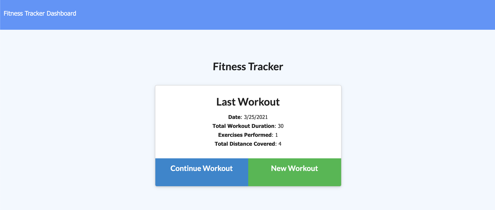

# Workout_Tracker

[]()

## Table of Contents

- [ Description ](#des)
- [ User Story ](#us)
- [ Business Context ](#bc)
- [ Demonstration ](#demo)
- [ Deployed Link](#link)
- [ Tech Used](#tech)
- [ Questions](#q)

## Description <a name="des"></a>

This is an application that can be used to track daily activities.

## User Story <a name="us"></a>

```
As a user, I want to be able to view create and track daily workouts. I want to be able to log multiple exercises in a workout on a given day. I should also be able to track the name, type, weight, sets, reps, and duration of exercise. If the exercise is a cardio exercise, I should be able to track my distance traveled.
```

## Business Context <a name="bc"></a>

```
A consumer will reach their fitness goals more quickly when they track their workout progress.
```

## Demonstration <a name="demo"></a>



## Deployed Link <a name="link"></a>

The project is deployed to Heroku and available for view :
<https://workout-tracker-with-mongodb.herokuapp.com/>

## Tech Used <a name="tech"></a>

<p>
    
    
    
  
</p>

## Questions <a name="q"></a>

- create an issue : <https://github.com/lk9988/Workout_Tracker/issues>
